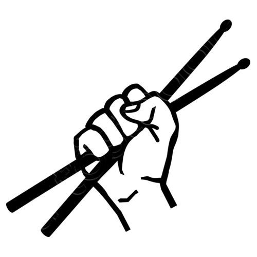

# JAM Project

Queremos solucionar la falta de información actual en relación a las Jams en Madrid en primer lugar.

**Motivación**

Poder conectar a espacios con gente atraida por las necesidades tanto musicales, como culturales

### Equipo

 - [Yoel Macia Delgado](https://github.com/ymdx) (Leader/contributor Backend/Frontend Developer)
 - [Pablo Carmona Gonzalez](https://github.com/PabloCarmona) (contributor Backend/Frontend Developer)
 - [Jorge Urosa Alonso](https://github.com/jorgeural) (contributor Backend/Frontend Developer)
 - [Chelo Quilón](https://github.com/lilxelo) (contributor Backend/Frontend Developer, Musica)
 - [Adel Zarrouk](https://github.com/eidal) (contributor Backend/Frontend Developer)

##### Agradecimientos

 - [Bryan McEire](https://github.com/mceire)
 - [Comunidad Open Source Weekends](https://github.com/OSWeekends)

##### Necesitamos

 - Feedback por parte de músicos y propietarios de espacios ( formularios ).
 - Branding
 - Diseño

### Demo

 - De momento no hay demo.

### Tecnología utilizada

 - Node JS
 - Pillars JS
 - Vue JS
 - MongoDB

#### Dependencias

- No definido

### Cómo contribuir en el proyecto

- No definido

**Más informacion en [CONTRIBUTING.md](CONTRIBUTING.md)**

### ¿Cómo usarlo?.

- No definido

#### TL:DR;

- No definido

#### Instalación

- No definido

### Estado del proyecto.

- Creación de los formularios para la primera iteracción de busqueda de feedback e interesados.

### Licencia

- GNU General Public License v3.0
